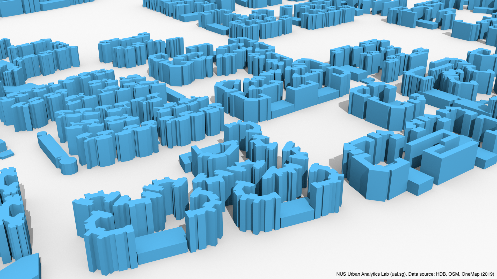
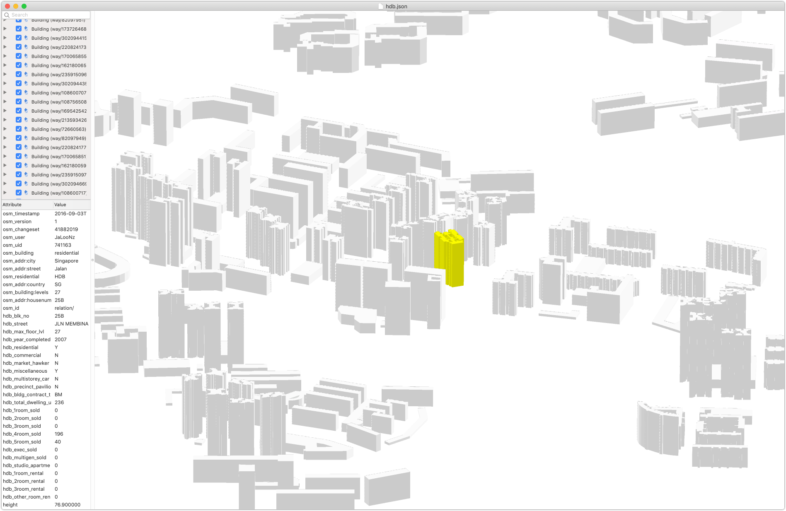
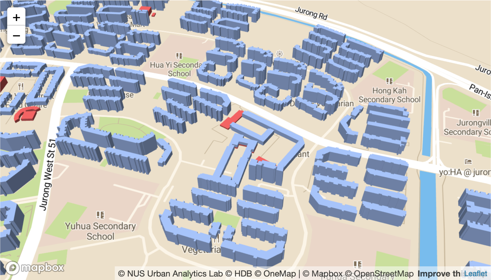
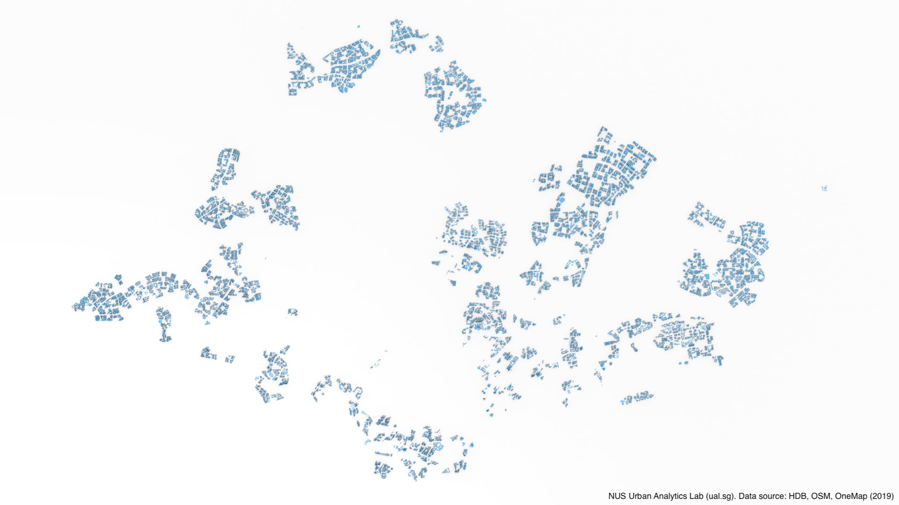

# 3D city model of Singapore public housing (HDB) buildings

Urban Analytics Lab, National University of Singapore



## Terms of use

If using the data, please mention the following data sources: NUS Urban Analytics Lab, HDB Singapore, OpenStreetMap contributors, and OneMap.
If you are using it for a nice publication, please cite the following paper:

```
@article{ceus_inferring_heights,
    author = {Biljecki, Filip and Ledoux, Hugo and Stoter, Jantien},
    title = {{Generating 3D city models without elevation data}},
    journal = {Computers, Environment and Urban Systems},
    year = {2017},
    volume = {64},
    pages = {1--18},
    month = jul
}
```


## Code

The code to generate the dataset is available on the [other Github repo](https://github.com/ualsg/hdb3d-code).


## Dataset

The dataset is available in the repository in two formats: 

* [CityJSON](https://www.cityjson.org)
* [OBJ](https://en.wikipedia.org/wiki/Wavefront_.obj_file)

The current version of the dataset was generated on 2019-08-25.

For viewing the CityJSON data we recommend [azul](https://itunes.apple.com/nl/app/azul/id1173239678?mt=12), the [CityJSON QGIS plugin](https://github.com/tudelft3d/cityjson-qgis-plugin), or the [web-viewer](https://viewer.cityjson.org/).
For the full list of software check the [official page](https://www.cityjson.org/software/).

In azul you will be able to see the attributes:



You can also use [Mapbox](https://www.mapbox.com):




### Metadata


| Key           | Value                    |
| ------------------| ------------------------------ |
| Coordinate system | SVY21 / Singapore TM ([EPSG:3414](https://epsg.io/3414)) |
| Unit | m |
| Number of buildings   | 12119   |
| Level of Detail   | 1.2 |
| geographicalExtent |  [11474, 28055, 0, 45327, 48759, 142] |
| geographicLocation | Singapore, Republic of Singapore |
| Dataset version | 2019-08-25 |
| OSM input data version | 2019-07-18 |
| HDB input data version | 2019-07-05 |

The dataset is semantically quite rich.
The attributes from OpenStreetMap are prefixed with `osm_`, while the ones from the HDB dataset are prefixed with `hdb_`.
Please note that some information are duplicated in both datasets.
We have included both sets of information just in case.
The list of the usual attributes is as follows:

| Key | Description | Example |
| --- | --- | --- |
| osm_id | ID of the geometry in OpenStreetMap | `way/440545194` |
| osm_timestamp | Time of update of the 2D geometry in OSM | `2016-09-04T05:06:21` |
| osm_building | General tag for buildings | `residential` |
| osm_addr_city | [Various address information](https://wiki.openstreetmap.org/wiki/Key:addr) | `Singapore` |
| osm_residential | A general tag for additional information | `HDB` |
| ... | ... |  |
| hdb_blk_no | HDB block number | `95B` |
| hdb_street | Street name | `HENDERSON ROAD` |
| hdb_residential | Residential building (Boolean) | `Y` |
| hdb_year_completed | Year of completion | `2018` |
| hdb_bldg_contract_town | Town | `BM` |
| hdb_total_dwelling_units | Number of units | `286` | 
| hdb_4room_sold | Number of 4-room sold flats | `104` |
| ... | ... |  |
| height | Estimated height in m | `113.3` |

For the metadata sourced from the [HDB Property Information](https://data.gov.sg/dataset/hdb-property-information) you may want to check the information found in the original dataset.
For OSM metadata, there is also a [dedicated page](https://wiki.openstreetmap.org/wiki/Key:building).

The dataset includes all types of HDB buildings, incl. commercial and carparks.
There are around 12 thousand HDB buildings in Singapore:



### Known issues

#### Multipolygons

A few OSM features are modelled as `MultyPolygon`. Only the first `Polygon` is taken into account.

#### Overlapping polygons

Some buildings (mostly carparks) slightly overlap with residential blocks because they are modelled like that in OSM.

#### Wrong polygon

Some buildings have been associated wrongly to a different OSM feature due to the discrepancies encountered in geocoding.

#### Missing buildings

About 30 (approx. 0.3%) buildings are omitted because they could not have been associated between HDB and OSM datasets.

### Future work

#### Terrain

This is an obvious one.
We put the elevation of zero for each building.
A direction for future work is to include a digital terrain model. 

#### Other buildings

This dataset does not contain all buildings in Singapore.
While OSM has an excellent coverage of Singapore, we don't have access to open data that would hint at heights of non-HDB buildings, and commercial objects, thus not much we can do about this for the time being.


#### Quality control

We haven't done a quality control since there is no ground truth data we can use.

Please note that this project is work in progress.
Contributors are welcome.
